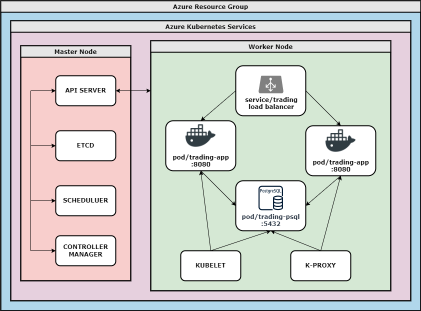
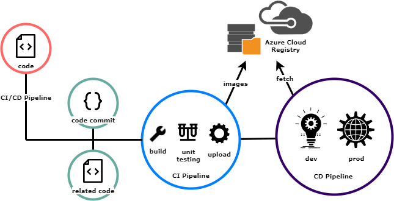

# Cloud/DevOps 

## Introduction

This project makes use of deployment concepts, in which we use multiple methods to deploy our Springboot trading application. To start, Microsoft Azure is utilized, using a resource group alongside Kubernetes to deploy the project. Within this cluster, we have our master node in tandem with a worker node created from configuration files. This worker node consists of 2 pods for our trading app, and a single pod for our PostgreSQL database - here, a load balancer is used to distribute traffic between the available pods. Auto scaling is also utilized to ensure that we have the correct number of pods scaled in relation to the amount of traffic on our server, however we can only scale up to a maximum of 2 pods as of the Azure trial limitations.

The project also uses a Jenkins CI/CD pipeline, that can build and deploy our trading application from both the dev and prod branches into its respective Kubernetes cluster. The Jenkinsfiles found in our Springboot repository are used to deploy our app, in which three stages are applied: init, build, and deploy. For the purpose of this assignment, both the dev and prod pipelines are more or less the same, however in practice it is used to differentiate between different build versions of the project.

Technologies Used: Bash, Docker, Helm, Jenkins, Kubernetes, Microsoft Azure

## Application Architecture

    

    <i> Application Architecture </i>

## Jenkins CI/CD Pipeline
A CI/CD pipeline is used to deploy either the dev or prod branch into its respective Kubernetes cluster. We made use of a Jenkins agent to create our pipeline, in which our agent uses an image with azure and kubectl installed necessary to deploy the app. A pod is create with the agent, and the app is then deployed by connecting to the Jenkins web UI and utilizing the Jenkinsfiles.

Each Jenkinsfile contains environment variables needed to execute the pipeline, as well as the init, build and deploy stages. With the init stage, we simply log in to Azure using `--service-principal` alongside our environment variables. Next is build, where the trading application image is built from the Dockerfile in the Springboot repo, and adds it to our Azure Cloud Repository. Lastly, we have the deploy stage; since the tickets had us manually deploying the cluster beforehand using bash commands, we simply use `kubectl set image` here to update our images.

As our trading application was previously coded during the Springboot project the code stage was skipped, and Unit Testing was also done during this stage of the project to ensure for correctness. After deployed, `kubectl get all` is used to check the state of the cluster, and if deployed without error, we would be able to view the application in the browser via external IP address.

    

    <i> CI/CD pipeline </i>

## Improvements
Listed below are three improvements that could be added to the application to improve it:
- **Fully Automated Pipeline**: As of now, the pipeline works as the cluster had been deployed manually beforehand; one could simply update the Jenkinsfiles to include the bash commands that execute this manual deployment, along with the necessary image update.

- **Unit and Integration Testing**: The CI section of the pipeline generally has testing done within it, however we skip this part as testing was done previously during creation of the trading app - we should add a way to test the application within our pipeline to ensure future builds are free of error and uphold correctness.

- **Improved Auto Scaling**: Restrictions set by the Azure free trial only allows for a maximum of two pods in our load balancer. If traffic to our server increases, it would be ideal that it would be able to scale up and handle the increased traffic accordingly. 
