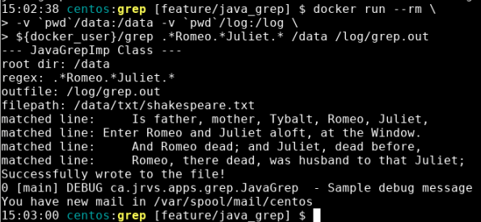

# Java Grep App

## Introduction

To filter through a directory of files is a task that can be difficult to do, especially if you are looking for specific information in said file. To do so, regular expressions can be used as a metric to filter through files that contain this parameter. With the use of docker provisioning alongside Java and Java Stream API's, this program is able to provide its end user a list of files in a given directory (and it's subdirectories) all files that contain a specified regular expression.

Technologies used: Git, IntelliJ, Linux, Maven, Docker, Jar, Java, Stream APIs

## Quick Start
 First, a docker command is used to pull the docker image stored within my dockerhub repository.
```
# Pull the docker image
docker pull tristantapson8/grep
```

Next, to run the program, we do so by running the docker container, and specifying the arguments to be passed into our container. The arguments we are using for this instance includes ***regex*** (the regular expression we are looking for in our directory), ***rootPath*** (the present working directory where files are searched via directory walk), and ***outFile*** (the path to the file where all lines matching the regular expression are found through the directory walk are written).
```
# Run the docker container
docker run --rm \
-v `pwd`/data:/data -v `pwd`/log:/log \
tristantapson8/grep [regex] [rootPath] [outFile]
```

## Implemenation
To implement the project, Java and Stream API's were used. Within the ***JavaGrepImp.java*** file, is a runner method called `process`, which dictates the entire flow of the program, using various helper methods. Below is the pseudocode for process:

```
matchedLines = []
for file in listFilesRecursively(rootDir)
  for line in readLines(file)
      if containsPattern(line)
        matchedLines.add(line)
writeToFile(matchedLines)
```

The process method uses helper functions to get our desired output of a single file that contains all lines mathcing a given regular expression. Some of the pseudocode functions are as follows:
- **listFilesRecursively**: Returns a Stream of all files within a present working directory.
    - Walks through all files in the present working directory using a Stream API
- **readLines**: Returns a Stream of all lines within a given file.
- **containsPattern**: Returns a boolean to determine if a line in a file matches the specified regular expression.
- **writeToFile**: Writes lines containing the regular expression into an output file
    - Done using a FileWriter, writing is done here by iterating through all lines matched with the regular expression stored in a list, and then writing these lines to the out file. 

> **_NOTE:_** Due to the potential issue of insufficient memory, stream APIs are used, and as such lambda notation is used within the actual implementation; despite this, the code snippet follows a similar flow to the code found in the JavaGrepImp.java file.

## Performance Issue
Due to the nature of this program, many files can be processed, varying in size. To ensure this app is able to process large amounts of data with a small memory heap, Stream APIs are used; the behaviour of stream chain processing helps in reducing the number of operations and iterations on data elements, thus reducing required memory and time.

## Test 
To test the java program, work was completed with IntelliJ in a linux virtual machine, primarily operated using the Command Line Interface; the end goal of the project is to provide a fast and efficient way to parse through a directory for key information using the concepts of regular expressions. Also applied to testing was the debugger found in IntelliJ, which was crucial in finding an issue with the listFiles function where it was not traversing subdirectories.

<p align="center">
    
</p>
<p align="center">
    <i>sample output for a regular expression looking for lines containing Romeo, followed by Juliet</i>
</p>

## Deployment
For the purpose of this assignment, the app code is stored on a remote repository. GitHub is used here, and development was done locally. In addtion, Dockerhub was used to create an image, which is stored within my Dockerhub repository. This docker image can be pulled to a local machine with a `docker pull` command in your command line interface.

## Improvements
Listed below are three improvements that could be added to the application to improve it:
- **Run Information**: After traversing the directories, a simple console output can be added that lists statistics of the files that were traversed through.

- **Additional Filtering**: Currently, the program searches through all files, regardless of the file extension - one could suggest adding a fourth parameter to the program, that lets the user determine which types of files that are to be parsed.

- **Addtional Output Information**: Although the app is able to identify lines containing the specified regular expression, it would be more useful to a user if the user was able to acess more information pertaining to a given line - the suggestion here is to have the program output the file/file path, along with the matched lines below, and the line number where the line is found within the file.
