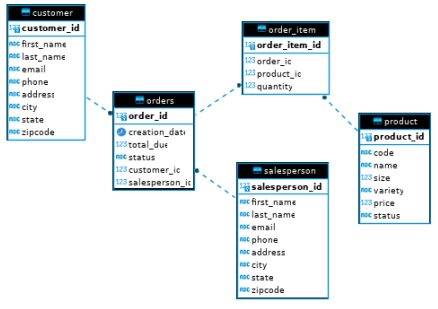
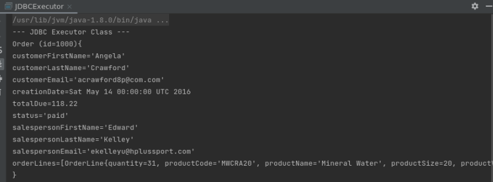

# JDBC App

## Introduction
Databases are useful in many different scenarios for storing data. It is typical to use a database when different sets of data needs to be linked together; in this case, we are using a database to store details about numerous customers and their pertaining order information. This app uses Java, along with its database connection API to connect to a PostgreSQL database in order to perform CRUD (Create, Read, Update, Delete) operations.

Technologies used: DBeaver, Docker, Git, IntelliJ, JDBC API, Java, Linux, Maven, PSQL

> **_NOTE:_** This app was implemented using the linkedIn learning course entitled ***Learning JDBC*** provided by Frank P Moley III. Further details about the course can be found at the following link:
https://www.linkedin.com/learning/learning-jdbc/get-going-with-data-access-in-java-14303479?autoplay=true&u=107506978

## Implementaiton
### ER Diagram
The ER diagram below is generated by DBeaver; it displays the entities, and their relationships between all the tables within our database, along with their accompanying fields.

<p align="center">
    
</p>
<p align="center">
    <i>an ER Diagram for our sample database</i>
</p>

### Design Patterns (TODO - explain which pattern is preffered and why...)
DAO (Data Access Object) is used to access data from our database of data storage, to abstract the retrieval of said data. It is a design pattern implemented with an  interface that has the familiar CRUD (Create, Read, Update, Delete) operations used to retrieve and manipulate various information within our database, regardless of the number of database tables. In addition, it provides a layer of abstraction between the JDBC and the rest of the code. 

Similar to the DAO design pattern is the repository design pattern, which deals with accessing a single table per class. Within our database, we are focusing on operations solely on the customer table, so this design pattern is also applicable.

## Test
To test the JDBC program, work was completed with IntelliJ in a linux virtual machine, primarily operated using the Command Line Interface; its purpose is to select and update data, work with transactions, handle exceptions, and more using the Java Database Connectivity (JDBC) API.

 First, a script is used to create the docker that provisions the PostgreSQL instance. The docker must first be created using a database username and password, to which the user can choose to start or stop the docker container accordingly. This docker provisioning script is the same script found within our `linux_sql` folder within our repository.
```
# Create and start a psql instance using psql_docker.sh
./linux_sql/scripts/psql_docker.sh create db_username db_password
./linux_sql/scripts/psql_docker.sh start
```

Once the docker is running, log in to the database, and then execute the downloadable scripts provided by the linkedIn learning course to populate the database accordingly: 

```
# Logging into Database
* `psql -h localhost -U postgres -d hplussport`

# Creating starter data
1. `psql -h localhost -U postgres -f database.sql`
2. `psql -h localhost -U postgres -d hplussport -f customer.sql`
3. `psql -h localhost -U postgres -d hplussport -f product.sql`
4. `psql -h localhost -U postgres -d hplussport -f salesperson.sql`
5. `psql -h localhost -U postgres -d hplussport -f orders.sql`
```

Lastly, the ***JDBCExecutor*** class is used to establish a connection to our database. Queries can now be performed on the database using DAO objects - in this project, we are using CRUD (Create, Read, Update, Delete) operations to manage and manipulate our stored data. To make sure these functions were fully operational, the methods were tested within the ***JDBCExececutor*** class, while querying the psql database afterwards to ensure that the operation had performed as intended.

<p align="center">
    
</p>
<p align="center">
    <i>sample query of persisted order data within the database</i>
</p>
