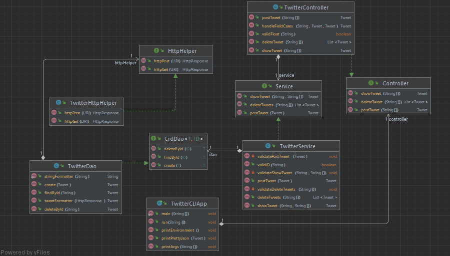
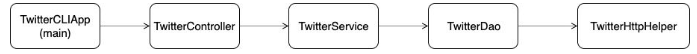
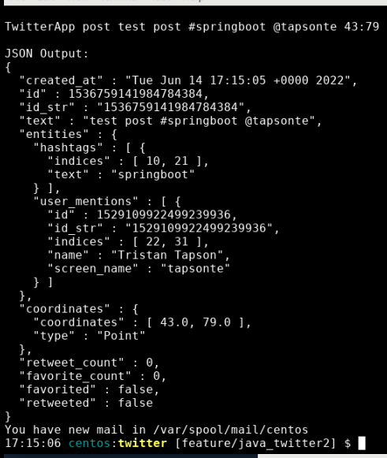

# Twitter CRUD App

## Introduction
Twitter is a popular social media app that is used to express one's own personal views or ideas. Although the app is simple and intuitive to use, it is a very complexed system once broken down. Twitter can be viewed as a more complexed CRUD (Create, Read, Update, Delete) application, where users can manage and update their accounts as they see fit. Created here is a simple tool alongside the usage of the Twitter API, that allows a user to manage their own personal Twitter account through the command line by CRUD operations without accessing the website directly.

Technologies used: Docker, Git, HTTP Clients, IntelliJ, Java, JUnit, Linux, Maven, Mockito, Postman, SpringBoot, Twitter REST API

> **_NOTE:_** This app is used to manage your own personal Twitter account through the command. To use this application in its entirety, access to a Twitter Developer account is needed, along with its accompanying API keys and access tokens. To apply for a Twitter Developer account, you can do so here at the following link:
 https://developer.twitter.com/en/portal/dashboard

## Quick Start
 First, a docker command is used to pull the docker image stored within my dockerhub repository.
```
Usage:
TwitterApp post|show|delete [options]

# Pull the docker image
docker pull tristantapson8/twitter
```
Next, to run the program, we do so by running the docker container, denoting the access keys, and specifying the arguments to be passed into our container. The arguments we are using for this instance includes a **CRUD operation** (the operation we are using to modify our twitter account), as well as a few other arguments depending on the initial operation chosen by the user. More information about the operations can be found below:

- **Post:** Allows a user to create and post a tweet to their own twitter account via command line specifying its `tweet_text` contents, as well as specify its geo location via longitude and latitude coordinates. It creates a tweet with a geotag, and outputs the created tweet object (simplified version) in a nicely formatted JSON string. The user will also recieve error messages if the `tweet_text` length is over 140 characters, or the geo tag is invalid (`latitude:longitude` is out of range).

    ```
    Usage:
    TwitterApp "post" "tweet_text" "latitude:longitude"
    
    # Post a tweet 
    docker run --rm \
    -e consumerKey=YOUR_VALUE \ 
    -e consumerSecret=YOUR_VALUE \
    -e accessToken=YOUR_VALUE \
    -e tokenSecret=YOUR_VALUE \
    tristantapson8/twitter post "test post" "43:79"
    ```

- **Show:** Allows a user to read a tweet from any public twitter account via command line by `tweet_id`. It outputs the created tweet object in a nicely formatted JSON string. The user will also recieve error messages if the `tweet_id` is invalid (non-digit characters). This method also contains an optional 3rd argument, where the user can request to show only specifed fields `[field1,field2,..]` in the formatted JSON string.

    ```
    Usage:
    TwitterApp show tweet_id [field1,field2,..]
    
    # Show a tweet 
    docker run --rm \
    -e consumerKey=YOUR_VALUE \
    -e consumerSecret=YOUR_VALUE \
    -e accessToken=YOUR_VALUE \
    -e tokenSecret=YOUR_VALUE \
    tristantapson8/twitter show 1276568976764686343 "id,text,created_at"
    ```
    
- **Delete:** Allows a user to delete their tweets from their own twitter account via command line by a list of tweet IDs `[id1,id2,..]`. Like all previous methods, this outputs the deleted tweet objects in a nicely formatted JSON string.

    ```
    Usage: TwitterApp delete [id1,id2,..]
    
    # Delete tweets
    docker run --rm \
    -e consumerKey=YOUR_VALUE \
    -e consumerSecret=YOUR_VALUE \
    -e accessToken=YOUR_VALUE \
    -e tokenSecret=YOUR_VALUE \
    tristantapson8/twitter delete 1200145224103841792,1276568976764686343
    ```

## Design (TODO: UML diagram)

<p align="center">
    
</p>
<p align="center">
    <i> UML Diagram </i>
</p>

### Components
To manage our Twitter account, the app uses the well known MVC architecture. For this implementation, the view component is excluded, as output is done simply into the command line console. The application consists of the following components:

- **Controller Layer**: The controller layer interacts and parses user input from the command line. This also calls the service layer, and returns the results. In our app, `TwitterCLIApp` creates the programs dependencies and also takes in arguments. The arguments are passed to `TwitterController` to be parsed, which then calls `TwitterService`.
- **Service Layer**: The service layer handles the business logic, and calls the data access layer to interact with the storage. The application uses `TwitterService` to make sure all the user inputs are valid, and then sends these valid results to `TwitterDao`.
- **Data Access Layer**: The data access layer handles the models. Through `TwitterDao`, the app is able to post, show, or delete a tweet using HTTP requests handled in `TwitterHttpHelper`.

<p align="center">
    
</p>
<p align="center">
    <i>class dependency diagram</i>
</p>

### Models
The models for this project are implemented with POJOs (Plain old java objects); classes containing private member variables and public getters and setters. We are creating a `Tweet` object which has a long list of root-level and fundamental attributes. These tweet objects are passed throughout the program, and ultimately end up being converted to a formatted JSON string that is easily readable for an end user. Since the full version of a tweet object is complicated, a simplified version of the full tweet object is used for this project which contains the following properties:

| Attribute | Type |  Description |
| --------- | ---- | ------------ |
| created_at |	String	| UTC time when this Tweet was created |
| id |	Int64 |	The integer representation of the unique identifier for this Tweet |
| id_str |	String	| The string representation of the unique identifier for this Tweet |
| text | String	| The actual UTF-8 text of the status update |
| entities | Entities | Entities which have been parsed out of the text of the Tweet |
| coordinates |	Coordinates	| Represents the geographic location of this Tweet as reported by the user or client application |
| retweet_count	| Int | Number of times this Tweet has been retweeted |
| favorite_count | Integer | Indicates approximately how many times this Tweet has been liked by Twitter users |
| favorited | Boolean | Indicates whether this Tweet has been liked by the authenticating user |
| retweeted | Boolean |	Indicates whether this Tweet has been Retweeted by the authenticating user |

### Spring
Spring framework is used to manage this applications dependencies. Although the dependencies in this project are linear, for more complexed projects with cyclic dependencies and various components, it is good practice to apply this framework to handle the dependency management problem. This Twitter app has its dependencies managed by the IoC container, and each component has a bean created for it which allows for dependency injection. 

## Test
Testing was done for the app using integration testing to ensure that the project was able to compile, as well as unit testing to ensure that the app is working as intended. **JUnit** is used here, with various assertion tests to ensure that intended use of the project does not include any logic errors. **Mockito** is also applied within the unit testing, as it allowed for testing of a class in isolation regardless of the necessary dependencies. To verify that the progam was working in entirety, after requesting a CRUD operation from the command line, users would be able to see if the program worked correctly such that the correct tweet objects being operated on were displayed in the console as a nicely formatted JSON string. In addition to this, users would also be able to view the changes directly on their Twitter account via the Twitter website.

<p align="center">
    
</p>
<p align="center">
    <i>sample output for a post tweet operation</i>
</p>

<p align="center">
    
</p>
<p align="center">
    <i>tweet created from post tweet operation </i>
</p>

## Deployment
For the purpose of this assignment, the app code is stored on a remote repository. GitHub is used here, and development was done locally. In addtion, Dockerhub was used to create an image, which is stored within my Dockerhub repository. This docker image can be pulled to a local machine with a `docker pull` command in your command line interface.

## Improvements
Listed below are three improvements that could be added to the application to improve it:
- **Additional Find Filtering**: Allow for a user to find tweets by other attributes that are not tweet ID; the user would be able to specify this as a command line argument, and have the tweet objects returned and displayed accordingly.

- **Full Tweet Object**: In this app, we are only dealing with a simplified tweet object. If we are to improve on the functionality of the app, it would be best to use the full version of the tweet object; in doing so, we would need to update the model used for the current version of this application, and update the service and controller components to account for these changes as well.

- **Database Functionality**: Since we are working with numerous tweet objects, it would be useful to store these retrieved objects and their data in a database, so that appropriate queries can be done on the persisted information.
