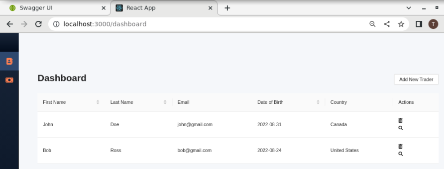
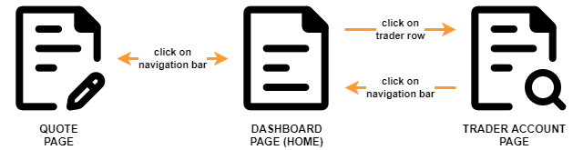
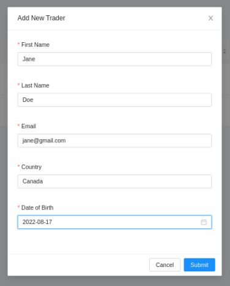
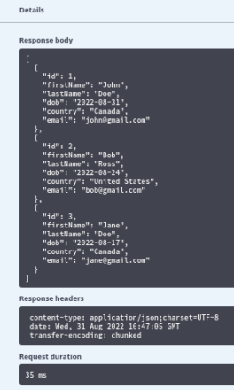

# Trading Frontend Application

## Introduction
A User interface is the point at which a user interacts with a computer, website or application. The goal of an effective UI is to make the user's experience easy and intuitive, requiring minimum effort on the user's part to receive the maximum desired outcome. Here, we make use of UX concepts, such that users can interact with with a backend trading application, manipulated entirely through a frontend. Users are able to add new trader accounts to the platform within the dashboard page, view a list of daily quotes within a quote page, and update a specific trader account in the trader account page. Created and styled using HTML and CSS alongside Javascript, endpoints from the backend can be accessed and managed by the frontend, allowing for a seamless user experience.

Technologies used: Docker, Git, HTML/CSS, IntelliJ, Javascript, Linux, Maven, NPM, React

> **_NOTE:_** This app is used to manage a trading platform through a frontend UI. To use this application in its entirety, youll need to have Node >= 14.0.0 and npm >= 5.6 on your machine. To install, you can find more about it here at the following link: https://github.com/nodesource/distributions/blob/master/README.md 


## Quick Start
First, install node and npm. Then verify that you have a valid docker version to use with the project. Once done, a docker command is used to pull the docker image stored within my dockerhub repository. Then a network is created to establish communication between Docker containers; these containers will be created later on in this section:   
```
# install Node and npm
curl -fsSL https://rpm.nodesource.com/setup_16.x | sudo bash -
yum install -y nodejs

# node version must be 14.0.0 or higher, npm version must be 5.6 or higher
node -v
npm -v

# docker version must be 17.05 or higher
docker -v

# download images
docker pull tristantapson8/trading-app:latest
docker pull tristantapson8/trading-psql:latest

# create a new docker network
docker network create --driver bridge trading-net
```
Next, to run the program, we do so by running a created docker container, denoting the access key, and specifying the environment variables to be used with our container. The environment variables we are using for this instance includes password, database name, and database user for our psql based container. For our app based container, environment variables include host, port number, and our API token, along with the previous environment variables included in the psql based container. More information about the containers can be found below, in addition to the neccessary code to be entered in the command line to run the program:
```
# start a docker container
# attach the container to the trading-net network
docker run --rm --name trading-psql-dev \
-e POSTGRES_USER=postgres \
-e POSTGRES_PASSWORD=password \
--network trading-net \
-d -p 5432:5432 tristantapson8/trading-psql

# set IEX credential 
IEX_PUB_TOKEN="YOUR_TOKEN"

# start trading-app container which is attached to the trading-net docker network
docker run -d --rm --name trading-app-dev \
-e "PSQL_URL=jdbc:postgresql://trading-psql-dev:5432/jrvstrading" \
-e "PSQL_USER=postgres" \
-e "PSQL_DB=jrvstrading" \
-e "PSQL_PASSWORD=password" \
-e "IEX_PUB_TOKEN=${IEX_PUB_TOKEN}" \
--network trading-net \
-p 8080:8080 -t tristantapson8/trading-app
```
After both running containers have been verified, navigate to the **trading-ui** directory within this repository, and execute `npm start` in the command line. Lastly, navigate to http://localhost:3000/dashboard/ in your browser to view and test the app using the interface. Upon finishing usage of the app, it is recommended that both the running containers be stopped, as to free up the assigned ports:

```
# verify two running docker containers
docker ps

# change to frontend application folder
cd trading-ui

# start the frontend application
npm start

# try frontend with your browser
http://localhost:3000/dashboard/

# stop containers
docker container stop trading-app-dev trading-psql-dev
```

<p align="center">
    
</p>
<p align="center">
    <i> dashboard for our frontend app </i>
</p>


## Implementation

To implement the app, Javascript was the main language used for pages and components. To access the backend and its endpoints, we used axios (a lightweight http client). It is promised based, which allowed us to take advantage of javascripts aysnc and await functions; Axios makes it easy to send asynchronous HTTP requests to REST endpoints. Javascript also makes use of the React library, where components get data from props, and are managed using state to be rendered and displayed in the frontend - HTML and CSS was used to stylize it.


### Architecture

<p align="center">
    
</p>
<p align="center">
    <i> Architecture Diagram </i>
</p>

 To manage our trader platform, the frontend makes use of multiple pages and features. The application consists of the following components:

- **Dashboard Page**: The main page; users are able to add traders to the platform, and view all traders currently on the platform along with relevant information pertaining to each trader. Users can delete a trader from the platform, and view their account information via adjacent buttons.
- **Quote Page**: To view the list of quotes available in the daily market for trading. Users can also see the current price of the quote, as well as its ask price and size, and its bid price and size.
- **Trader Account Page**: Accessed from the dashboard page, users can view their account information. They can also add funds to their account, and withdraw them as well.

## Test
Testing was done for the app manually in the browser. After implementation, a feature was tested at user discretion. The navigation bar should allow for correct page navigation, and the buttons would work accordingly, to navigate to another page, or display a modal form. Modal forms also included form validation, and form submission would not be done if the user incorrectly entered a form field. In addition, users could verify that the information in the backend from the Swagger UI matched what was displayed in the frontend interface.

<p align="center">
    
</p>

<p align="center">
    
</p>
<p align="center">
    <i> response body from modal testing  </i>
</p>

## Deployment

For the purpose of this assignment, the app code is stored on a remote repository. GitHub is used here, and development was done locally. In addtion, Docker commands were used to create images, which is stored within my Dockerhub repository. The docker images can be pulled to a local machine with a docker pull command in your command line interface. As there are two images (PSQL and app image) needed for the frontend application, a container respectively pertaining to each one is needed, which are then connected through a Docker network and ran individually. In practice, a frontend is usually hosted somewhere with the backend accessed via images or endpoints, so the frontend portion of this project is not currently containerized.

## Improvements
Listed below are three improvements that could be added to the application to improve it:
- **Complete Implementation**: Within the backend, there are more endpoints that cannot be currently access by a user in the frontend; additional components and pages can be added to reflect the completeness of the backend.

- **Start-up Script**: A script could be implemented that will pull the neccessary docker images, and create and run docker containers; a user would simply have to execute a single line of code within the command line, and then easily view the frontend in their browser. 

- **Additional Notifications**: Currently when you try to do an illegal action (such as withdrawing funds from an empty account, or deleting an account with funds), there is no information relayed to the user as to why their action was not performed. Additional notifications or modification of modal forms can be applied here, to notify to the user that their action was not performed, and a message will display reason as to why their action was illegal. 
