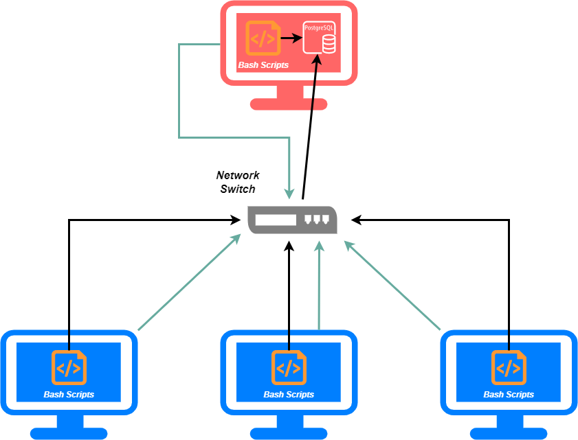
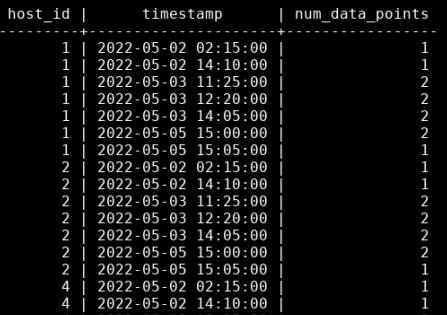

# Linux Cluster Monitoring Agent

## Introduction

To manage a Linux cluster of nodes, hardware specifications and resource usage must be recorded. To do so, this said relevant information is collected and stores in an RDBMS database, while feedback about the node usage is retrieved from it using database querying. With the use of docker provisioning alongside database management & querying, this program is able to provide tangible results as readable data to its end user.

Technologies used: Bash, Docker, Git, Linux, PostgreSQL

## Quick Start
 First, a script is used to create the docker that provisions the PostgreSQL instance. The docker must first be created using a database username and password, to which the user can choose to start or stop the docker container accordingly.
```
# Create and start a psql instance using psql_docker.sh
./scripts/psql_docker.sh create db_username db_password
./scripts/psql_docker.sh start
```

Next, to store our data, we must create database tables with their accompanying fields as a means to retrieve it. However, we must first create the database to store the tables by connecting to the instance using `psql -h psql_host -U psql_user -W`. Once connected to the instance, create a database called ***host_agent*** via `CREATE DATABASE host_agent;`, where tables to store our relevant information are held.

Now that the database has been created, we must connect to the database, and create tables within it to store our relevant data. The tables used to store this information are called ***host_info*** and ***host_usage***, which contain fields to store hardware information and its resource usage respectively.
```
# Create tables using ddl.sql
psql -h localhost -U postgres -d host_agent -f sql/ddl.sql
```

Once these tables have been created within the database successfully, we can begin inserting data into them. After running our scripts, the database tables will be populated in their fields accordingly.
> **_NOTE:_** It is a prerequisite that inserts are done for the ***host_info*** table first, and the ***host_usage*** table second, as the ***host_usage*** table contains a ***FOREIGN KEY*** linking it to the ***host_info*** table.

```
# Insert hardware specs data into the DB using host_info.sh
./scripts/host_info.sh psql_host psql_port db_name psql_user psql_password

#  Insert hardware usage data into the DB using host_usage.sh
./scripts/host_usage.sh psql_host psql_port db_name psql_user psql_password
```

Since we need to execute the ***host_usage.sh*** script repeatedly, we can do this using a crontab. Open and edit a crontab file using `crontab -e`, and insert the below lines into the file. You can then list the crontab jobs with  `crontab -l`. It is also recommended that you validate your results from the psql instance by connecting to it, and querying the ***host_usage*** table with a simple  `SELECT * FROM host_usage;` query.
```
# Crontab setup
* * * * * bash /home/centos/dev/jrvs_data_eng_[FirstnameLastname]/linux_sql/host_agent/scripts/host_usage.sh localhost 5432 host_agent postgres password > /tmp/host_usage.log
```

Lastly, you want to display your query results, which retreives and outputs useful data to the user attained via SQL from the database tables about the hardware information and resource usage.
```
# Query display
psql -h psql_host -U psql_user -d db_name -f sql/queries.sql
```

## Implemenation
To implement the project, a docker container is created, used to provision an instance of postgreSQL. Once provisioned, a database is created, and structured with appropriate tables to store hardware and resource usage information. Bash scripts are then used to retrieve this information, along with a crontab set at regular intervals. Afterwards, querying is done on the now populated tables, and meaningful results are displayed to a user.

### Architecture (TODO - architecture image file)
The architecture diagram below represents the cluster monitoring agent; it uses a client-server architecture. Client machines are denoted in blue, and the server is denoted in red. Accompanying connections and data transfers are represented by the arrows.


<p align="center">
    *client-server architecture diagram for the cluster monitoring agent*
</p>

### Scripts
Shell script description(s) and usage:

- psql_docker.sh
   This script is used to create, start, and stop the docker container
    ```
    ./scripts/psql_docker.sh create|start|stop [db_username] [db_password]
    ```
- host_info.sh
    This script inserts hardware information of the host machine into the database
    ```
    ./scripts/host_info.sh psql_host psql_port db_name psql_user psql_password
    ```
- host_usage.sh
    This script inserts resource usage information of the host machine into the database
    ```
    ./scripts/host_info.sh psql_host psql_port db_name psql_user psql_password
    ```
- crontab
  This file is used to run ***host_usage.sh*** over repeated intervals

- queries.sql
    This script is used to display the results of queries on the tables within the ***host_agent*** database
    ```
    psql -h psql_host -U psql_user -d db_name -f sql/queries.sql
    ```
## Database Modeling
Inside the database, two tables are used for storing hardware information and usage:

***Host Info***

| Value       | Description |  Type       | Constraint(s) |
| ----------- | ----------- | ----------- | ------------- |
| id | unique numeric identifier for each computer |  serial | primary key|
| hostname  | unique name for each host       | varchar | unique |
| cpu_number | number of CPUs in the host computer | int | not null |
| cpu_architecture | architecture of the host computer | varchar | not null |
| cpu_model | model of the host computer | varchar | not null |
| cpu_mhz | microprocessor clock speed | float | not null |
| L2_cache | CPU cache memory (in kB) | int | not null |
| total_mem | RAM memory (in kB) | int | not null |
| timestamp | host information retrieval date | timestamp | not null |

***Host Usage***

| Value       | Description |  Type       | Constraint(s) |
| ----------- | ----------- | ----------- | ------------- |
| timestamp | host usage retrieval date | timestamp | not null |
| host_id | unique numeric identifier for each computer | SERIAL | foreign key |
| memory_free | available memory (in mB) | int | not null |
| cpu_idle | CPU idle percentage | int | not null |
| cpu_kernel | CPU kernel percentage | int | not null |
| disk_io | number of disk I/O | int | not null |
| disk_available | root directory avaiable disk space (in mB) | int | not null |

## Test 
To test the bash scripts and queries, work was completed within a linux virtual machine, primarily operated using the Command Line Interface. The end goal of the project is to provide tangible results, which is done using database querying. Further information about the specific queries can be found in the ***/sql/queries.sql*** file. 


*sample output for a server failure query*

## Deployment
For the purpose of this assignment, the app code (scripts & sql files) is stored on a remote repository. GitHub is used here, and development was done locally. In addtion, docker is used to create a container, with a specific postgreSQL image.

## Improvements
Listed below are three improvements that could be added to the application to improve it:
- **handle hardware updates**
Computer hardware may be updated, and it would be useful to have a script that allows for a user to update these changes within the database tables.

- **database creation**
Although we are to assume the appropriate database has been created, it is also recommended that we create the database before hand (either using a script or sql create) if the project is ported onto other machines. 

- **single run script**
By having a single run script in addition to including the afformentioned database creation change, we could entirely automate the process. In addition, it would also be good practice to create either a terminal output or log file that will let the user know which part of the cluster agent program failed, assuming we are structuring our single run script to use all the scripts we have initially created for this program.
