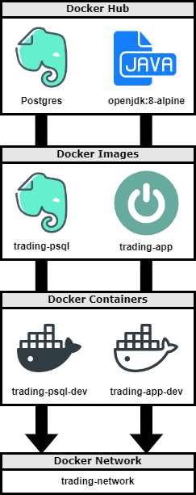

# Springboot Trading Rest API

## Table of contents
* [Introduction](#Introduction)
* [Quick Start](#Quick-Start)
* [Implementation](#Implementation)
* [REST API Usage](#REST-API-Usage)
* [Test](#Test)
* [Deployment](#Deployment)
* [Improvements](#Improvements)

## Introduction
A security is a financial investment with some monetary value that entitles the holder to ownership of a part of a publicly traded company, such as a stock. Securities are listed on the stock exchange, and can be bought, sold, or traded on the secondary market. Created here is a simple tool, alongside the usage of the IEX Cloud API, that allows users to manage client profiles and accounts, monitor portofolio peformance, and trade securities.

Technologies used: Docker, Git, HTTP Clients, IEX Cloud API, IntelliJ, Java, JUnit, Linux, Maven, SpringBoot, Swagger UI, Tomcat

> **_NOTE:_** This app is used to manage a trading platform through a Swagger UI. To use this application in its entirety, access to a IEX Cloud account is needed, along with its accompanying API keys and access tokens. To apply for a IEX Cloud account, you can do so here at the following link: https://iexcloud.io/console/tokens

## Quick Start
First verify that you have a valid docker version to use with the project. Once done, a docker command is used to pull the docker image stored within my dockerhub repository. Then a network is created to establish communication between Docker containers; these containers will be created later on in this section:

```
# docker version must be 17.05 or higher
docker -v

# download images
docker pull tristantapson8/trading-app:latest
docker pull tristantapson8/trading-psql:latest

# create a new docker network
docker network create --driver bridge trading-net
```
Next, to run the program, we do so by running a created docker container, denoting the access key, and specifying the environment variables to be used with our container. The environment variables we are using for this instance includes password, database name, and database user for our psql based container. For our app based container, environment variables include host, port number, and our API token, along with the previous environment variables included in the psql based container. More information about the containers can be found below, in addition to the neccessary code to be entered in the command line to run the program:
```
# start a docker container
# attach the container to the trading-net network
docker run --rm --name trading-psql-dev \
-e POSTGRES_USER=postgres \
-e POSTGRES_PASSWORD=password \
--network trading-net \
-d -p 5432:5432 tristantapson8/trading-psql

# set IEX credential 
IEX_PUB_TOKEN="YOUR_TOKEN"

# start trading-app container which is attached to the trading-net docker network
docker run -d --rm --name trading-app-dev \
-e "PSQL_URL=jdbc:postgresql://trading-psql-dev:5432/jrvstrading" \
-e "PSQL_USER=postgres" \
-e "PSQL_DB=jrvstrading" \
-e "PSQL_PASSWORD=password" \
-e "IEX_PUB_TOKEN=${IEX_PUB_TOKEN}" \
--network trading-net \
-p 8080:8080 -t tristantapson8/trading-app
```
After both running containers have been verified, navigate to http://localhost:8080/swagger-ui.html#/ in your browser to view and test the app and its endpoints using the Swagger UI. Upon finishing usage of the app, it is recommended that both the running containers be stopped, as to free up the assigned ports:

```
# verify two running docker containers
docker ps

# try REST APIs with your browser
http://localhost:8080/swagger-ui.html/

# stop containers
docker container stop trading-app-dev trading-psql-dev
```

<p align="center">
    
</p>
<p align="center">
    <i> Swagger UI for our trading app </i>
</p>


## Implementation

<p align="center">
    
</p>
<p align="center">
    <i> Component Diagram (red = controller layer, yellow = service layer, blue = data access layer) </i>
</p>

### Architecture
To manage our trader application, the app uses a three tier architecture. Within the client tier, users can use HTTP clients to consume the IEX Cloud API. The application tier is divided into a controller layer, service layer, and a data access layer to process all relevant information retrieved by the client tier using Java. Lastly, the database tier is used as a means to store the data proccessed from the application tier inside a database instance. The application consists of the following components:

- **Controller Layer**: This layer is used to primarily handle user requests, done through `traderAccountController`, `quoteController`, `orderController`, and `dashBoardController`. Accessed through the Swagger UI, a user can test endpoints, which will then process the request and pass the retrieved information on to the service layer.
- **Service Layer**: Within this layer the business logic is handled; through `traderAccountService`, `quoteService`, `orderService`, and `dashboardSevice`, the information passed from the controllers are processed and verified, and subsequently calls the needed components from the data access layer.
- **Data Access Layer**: The final layer that interacts with the Database, while making use of the DAO design pattern. It is able to perform CRUD operations on our database, where Java objects are converted into SQL queries, with respect to database persistence and SQL injection.
- **SpringBoot**: To handle the IoC problem, Spring framework is used to manage this applications dependencies. This trading app has its dependencies managed by the IoC container, and each component has a bean created for it which handles dependency injection. In addition, the app uses **Tomcat** as its web servlet, allowing the trading platform to function as a web app, viewed within the Swagger UI.
- **PSQL and IEX**: To store information a PSQL database is used; this database is created using an SQL script, which creates our necessary tables for persisted information. The IEX Cloud API is also applied to our app, allowing access of quote data from the market.
  > **_NOTE:_** Eligible quote symbols and more can be found here at the following link: https://finviz.com/map.ashx

## REST API Usage

### Swagger
Swagger UI allows a development team to visualize and interact with an APIs resources without having any of the implementation logic in place; primarily, it is used to test endpoints via controllers in conjunction with a project given a Swagger configuration; its utility lies within allowing for the development and testing of a backend, without the need for an implemented frontend. More information can be found about the controllers and their pertaining endpoints below: 

- ### Quote Controller
  The quote controller is able to access security information from the IEX market, and store its relevant information in our database. Users are able to view security information by symbol, update and view the localized daily list, as well as update all quotes agaisnt the IEX market data. (Since the full version of a quote object is complicated, a simplified version of the full quote object is used for this project found in `./model/domain.Quote.java`).

  | Endpoint | Description |
  | -------- | ----------- |
  | **GET**  `/quote/dailyList` | Show the dailyList |
  | **GET**  `/quote/iex/ticker/{ticker}` | Show iexQuote
  | **POST**  `/quote/tickerId/{tickerId}` | Add a new ticker to the dailyList (quoteTable) |
  | **PUT**  `/quote/` | Update a given quote in the quote table |
  | **PUT**  `/quote/iexMarketData` | Update quote table using IEX data |

- ### Trader Controller
  The trader controller allows for management of traders and all pertaining trader account information. Users are able to create and delete traders, and update their accounts by depositing or withdrawing funds. 

  | Endpoint | Description |
  | -------- | ----------- |
  | **DELETE**  `/trader/traderId/{traderId}` | Delete a trader |
  | **POST**  `/trader/` | Create a trader and an account with DTO |
  | **POST**  `/trader/firstname/{firstname}/lastname/{lastname}/dob/{dob}/country/{country}/email/{email}` | Create a trader and an account |
  | **PUT**  `/trader/deposit/traderId/{traderId}/amount/{amount}` | Deposit a fund |
  | **PUT**  `/trader/withdraw/traderId/{traderId}/amount/{amount}` | Withdraw a fund |
  
 - ### Order Controller
   The order controller allows for traders to buy stocks from the daily market, if they have the necessary funds to do so. It will also allow for the selling of stocks, assuming that the trader has the required position to do so. Upon a successful order, the traders account will be updated accordingly with the correct funds and position.

    | Endpoint | Description |
    | -------- | ----------- |
    | **POST**  `/order/marketOrder` | Submit a market order |
    
- ### Dashboard Controller
   The dashboard controller allows for viewing of traders on the platform. All traders can be viewed here, as well as their
   trader profiles and portfolios.

    | Endpoint | Description |
    | -------- | ----------- |
    | **GET**  `/dashboard/portfolio/traderId/{traderId}` | Show portfolio by trader ID |
    | **GET**  `/dashboard/profile/traderId/{traderId}` | Show trader profile by trader ID |
    | **GET**  `/dashboard/traders` | Show all traders |

## Test
Testing was done for the app using integration testing to ensure that the project was able to compile, as well as unit testing to ensure that the app is working as intended. **JUnit** is used here, with various assertion tests to ensure that intended use of the project does not include any logic errors. To verify that the progam was working in entirety, a user could open up the Swagger UI to test the endpoints; if correctly implemented, a proper response body would be returned, and displayed to the user in the UI. In addition to this, users would also be able to connect to the PSQL database through the command line, and verify that the requested information has been persisted correctly into the database.

<p align="center">
    
</p>
<p align="center">
</p>

<p align="center">
    
</p>
<p align="center">
</p>

<p align="center">
    
</p>
<p align="center">
    <i> response body and updated database from endpoint testing </i>
</p>

Additionally, line coverage is applied to ensure that the application is robust. For this project, it is required that a line coverage of 50% or greater was needed for all service and DAO classes. Below is the coverage for our trading app:

<p align="center">
    
</p>
<p align="center">
    <i> line coverage for the trading app </i>
</p>

## Deployment


<p align="center">
    
</p>
<p align="center">
    <i> Docker diagram  </i>
</p>
For the purpose of this assignment, the app code is stored on a remote repository. GitHub is used here, and development was done locally. In addtion, Docker commands were used to create images, which is stored within my Dockerhub repository. The docker images can be pulled to a local machine with a docker pull command in your command line interface. As there are two images (PSQL and app image) needed for the trading platform, a container respectively pertaining to each one is needed, which are then connected through a Docker network and ran individually. To build the images from this repository, see the following code below:

```
# build the psql image
cd ./springboot/psql/sql_ddl/
docker build -t trading-psql .

# build the app image
cd ./springboot/
docker build -t trading-app .

# verify images
docker image ls -f reference=trading-psql
docker image ls -f reference=trading-app
```

## Improvements
Listed below are three improvements that could be added to the application to improve it:
- **Multiple Accounts**: Currently, the program is only able to function on the condition that a trader has one account; future versions of the app could allow for multiple accounts associated with a single trader, and the source code would be updated accordingly.

- **Start-up Script**: A script could be implemented that will pull the neccessary docker images, and create and run docker containers; a user would simply have to execute a single line of code within the command line, and then easily view the Swagger UI in their browser.

- **Simulated Trading Market**: Allow for the purchase and selling of securities by traders - this may need for the implementation of additional controllers and updated component layers, or even an entire restructuring of the project. Despite this, having a fully functional trading platform would be a good proof of concept to demonstrate to a company that is heavily invested in this field.
